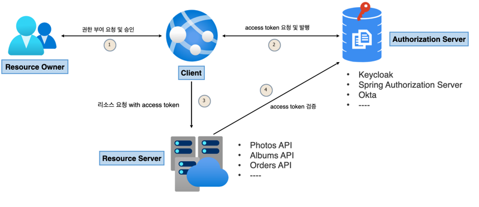

# OAuth 2.0 Fundamentals

-----

1. OAuth = Open + Authorization(인가)
   - 인가 : 권한을 부여한다.
   - OAuth 2.0 Authorization Framework(RFC 6749)
   - 사용자가 속한 사이트의 보호된 자원(사용자 정보)에 대해 어플리케이션의 접근을 허용하도록 승인하는 것

   
2. Delegated authorization framework - 위임 인가 프레임워크
   - 어플리케이션이 사용자의 데이터에 접근하도록 권한을 부여한다.
   - 즉, 인가 서버가 어플리케이션이 권한을 부여한다.

### 이전방식
- 직접 아이디와 패스워드를 입력하여 로그인함으로 계정정보가 노출되어 보안에 취약하다.
- OAuth를 사용하면 계정정보가 노출될 필요 없이 로그인 및 사용자가 허용한 정보에 접근이 가능하다.
- 사용자 정보의 접근 권한을 주는 주체는 사용자가 된다.

-----

## Oauth 2.0 Roles
- Oauth 2.0은 다음 네가지 종류의 역할을 담당하는 주체들에 의해 이루어지는 권한 부여 체계이다.

1. Resource Owner(자원 소유자)
   - 보호된 자원에 대한 접근 권한을 부여할 수 있는 주체, 계정의 일부에 대한 접근 권한을 부여하는 사람.
   - 사용자를 대신하여 작동하려는 모든 클라이언트는 먼저 사용자의 허가를 받아아함.
     
2. Resource Service(보호 자원 서버)
   - 클라이언트(다른 어플리케이션)에서 접근하는 사용자의 자원이 저장되어 있는 서버.
   - 액세스 토큰을 수락 및 검증할 수 있어야 하며 권한 체계에 따라 요청을 승인할 수 있어야 한다.
     
3. Authorization Server(인가 서버)
   - 클라이언트의 권한 부여 요청을 승이하거나 거부하는 서버.
   - 사용자가 클라이언트에게 권한 부여 요청을 승인한 후 액세스 토큰을 클라이언트에게 부여하는 역할.
     
4. Client(클라이언트)
   - 사용자를 대신하여 권한을 부여받아 사용자의 리소스에 접근하려는 어플리케이션
   - 사용자를 권한 부여 서버로 안내함.

## Oauth 2.0 Client Types
- 인증 서버에 클라이언트를 등록할 때 클라이언트 아이디와 클라이언트 시크릿이 발급된다.

### 기밀 클라이언트
- 클라이언트 시크릿의 기밀성을 유지할 수 있는 클라이언트를 의미.
- NET, JAVA, PHP, Node JS와 같은 서버 언어로 만들어진 응용프로그램.
- 액세스 토큰 발급 Flow
  1. 클라이언트가 인가서버에 요청을 보냄
  2. 인가서버에서 redirect code를 발급함
  3. 클라이언트가 Back channel client에 코드를 넘김
  4. Back channel client에서 code를 Back channel 인가서버에 전달함
  5. 인가서버에서 액세스 토큰을 발급

### 공개 클라이언트
- 클라이언트 시크릿의 기밀을 유지할 수 없으므로 이런 앱에서는 시크릿이 사용되지 않는다
- javascript, 모바일 앱뿐만아니라 iot/임베디드 장치에서 실행되는 애플리케이션.
- 크롬 개발자 콘솔이나 디버깅 도구를 사용하여 기밀 정보를 추출할 수 있기 때문에 공개로 간주함.
- 서버측이 아닌 리소스 소유자가 사용하는 장치에서 실행되는 모든 클라이언트는 공개 클라이언트로 간주된다.
- 액세스 토큰 발급 Flow
  1. 클라이언트가 인가서버에 요청을 보냄
  2. 인가서버에서 액세스 토큰을 발급함

-----
## Oauth 2.0 Token Types

### Access Token
- 보호된 리소스에 접근하기 위해 사용하는 일종의 자격 증명, 리소스 소유자가 클라이언트에게 부여한 권한부여의 표현.
- 일반적으로 JWT(JSON Web Token) 형식을 취함.
   - 토큰에는 토큰 만료 기간, 범위 및 서버에 필요한 기타 정보가 있다.
- 타입에는 식별자 타입과 자체 포함타 입이 있다.
- 자체 포함 타입에는 사용자의 정보나 만료기간등의 정보등 유의미한 정보를 포함되어있다.
  - 특정한 암호화 알고리즘에 의해 개인키로 서명되고 공개키로 검증할 수 있으며 만료될 때까지 유효하다.
  - 인가서버와 네트워크 통신 없이 리소스 서버에서 토큰 자체 검증이 가능하다.
- 식별자 타입은 인가서버에서 난수를 발급하여 해당 난수와 사용자 정보를 디비에 저장하여 사용한다.
  - 해당 토큰(난수)을 수신한 API는 토큰의 유효성을 검사하기 위해 인가서버에 대한 백채널 통신을 열고 DB를 조회해야 한다.
  - 네트워크와 DB Connection 비용이 발생한다.

### Refresh Token
- 액세스 토큰이 만료된 후 새 액세스 토큰을 얻기 위해 클라이언트 응용 프로그램에서 사용하는 자격 증명
- 인증 서버는 Refresh Token의 유효성을 검사하고 새 액세스 토큰을 발급한다.
- Refresh Token은 액세스 토큰과 달리 권한 서버 토큰 엔드포인트에만 보내고 리소스 서버에는 보내지 않는다.

### ID Token
- OpenID Connect 사용
- 권한 부여 서버에서 발급되며 사용자에 대한 정보를 전달.
- 액세스 토큰 대신 또는 함께 전송함.

### Authorization Code
- 권한 부여 코드 흐름에서 사용, 클라이언트가 액세스 토큰과 교환할 임시 코드.(1회용)
- 클라이언트가 요청하는 정보를 확인하고 인가 서버로부터 리다이렉트되어 받아온다.