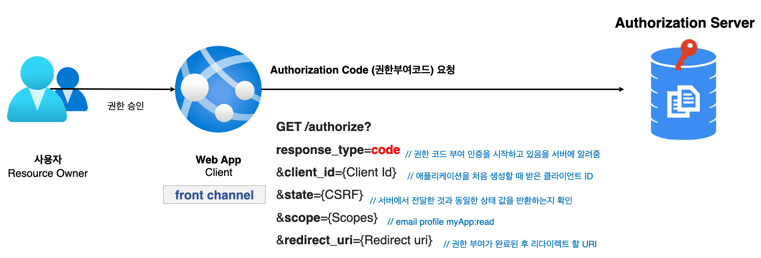
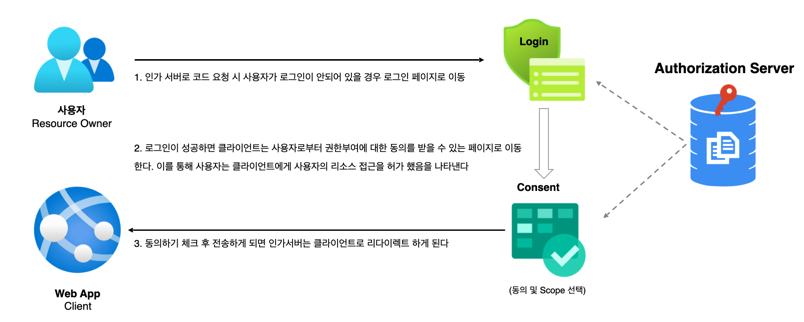
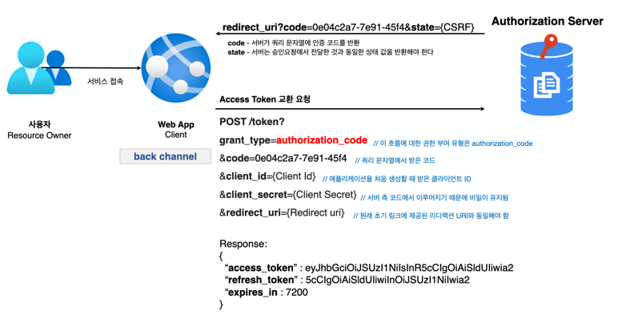
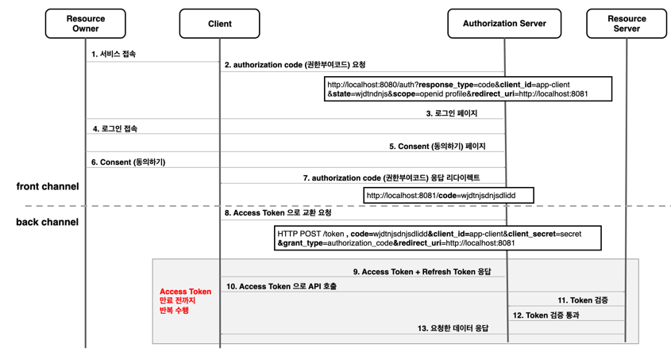
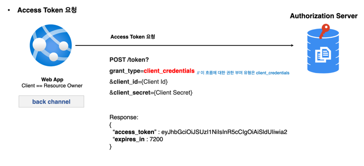
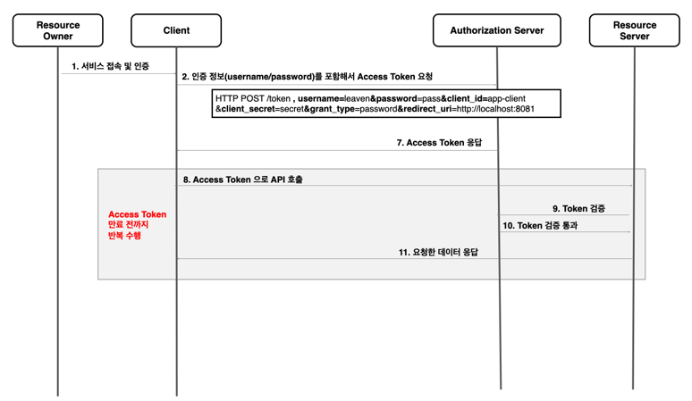
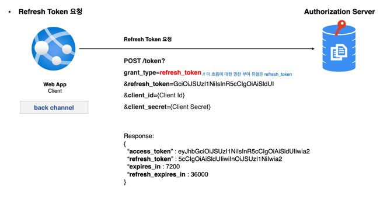
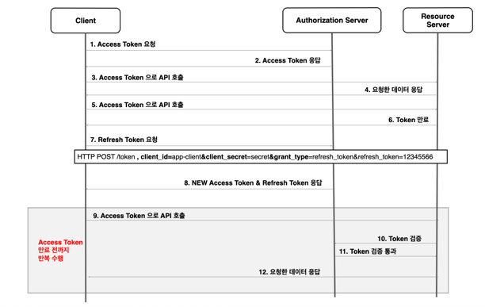

## Oauth 2.0 Grant Type

-----

### 권한 부여 유형

- 클라이언트가 사용자를 대신해서 사용자의 승인하에 인가서버로부터 권한을 부여받는 것.

1. Authorization Code Grant Type
   - 권한 코드 부여 타입. 
   - 가장 보안에 안전한 유형.
2. Client Credentials Grant Type
   - 클라이언트 자격 증명 권한 부여 타입, 클라이언트 아이디와 클라이언트 시크릿만 존재하면 가능
   - 서버 애플리케이션에서 사용됨.(server to server)
3. Refresh Token Grant Type
   - Refresh 토큰으로 권한부여를 따로 하지 않고 새롭게 토큰을 발급 받을수 있는 타입.
   - Authorization Code Type 에서 지원.
4. PKCE-enhanced Authorization Code Grant Type 
   - Authorization Code Type과 비슷하지만 PKCE(Proof Key of Code Exchange)를 사용하여 좀 더 강화된 타입.
   - 코드를 발급 받을때 추가로 해쉬된 값을 전달해서 코드를 발급 받는다.
5. Implicit Grant Type ***(deprecated)***
   - 암시적 부여 타입, 공개 클라이언트 애플리케이션(개발자 도구로 스크립트 확인 가능).
   - 보안에 취약함.
6. Resource Owner Password Credentials Grant Type ***(deprecated)***
   - 사용자의 패스워드를 통해서 자격 증명을 부여받는 타입, 패스워드 노출 가능성 있음.
   - 보안에 취약함.

### 매개 변수 용어
- 클라이언트가 인가서버에게 요청을 할때 필요한 변수들.

  #### client_id
  - 인가서버에 등록된 클라이언트에 대해 생성된 고유 키
  #### client_secret
  - 인가서버에 등록된 특정 클라이언트의 비밀 값
  #### response_type
  - 애플리케이션이 권한 부여 코드 흐름을 시작하고 있음을 인증 서버에 알려준다.
  - code, token, id_token 이 있으며, token, id_token은 Implicit 권한 부여 유형에서 지원해야 한다.
  - callback url에 code와 token이 붙여서 나옴
  #### grant_type
  - 권한 부여 타입 지정
  #### redirect_uri
  - 사용자가 애플리케이션을 성공적으로 승인하면 권한 부여 서버가 사용자를 다시 애플리케이션으로 리다이렉션한다.
  - 토큰 요청의 redirect_uri 는 인증 코드를 생성할 때 사용된 redirect_uri 와 정획히 일치해야 한다.
  #### scope
  - 애플리케이션이 사용자 데이터에 접근하는 것을 제한하기 위해 사용된다.(profile, email)
  - 인가서버에 존재하는 scope를 사용해야 한다.
  - 특정 스코프로 제한된 권한 인가권을 발행함으로써 데이터 접근을 제한한다.
  #### state
  - 클라이언트가 인가서버에 요청을 보낼 때 임의의 문자열을 포함시켜 보내주고 승인 후 서버로부터 동일한 값이 반환되는지 확인해야 한다.
  - CSRF 공격을 방지하는데 사용된다.(위조 방지)

## 권한 부여 방식별 설명

-----

### Authorization Code Grant Type
1. 흐름 및 특징
   - 사용자가 애플리케이션을 승인하면 인가서버는 redirect URI로 임시 코드(`권한부여코드`)를 담아서 애플리케이션으로 다시 리다이렉션 한다.(1단계)
   - 애플리케이션은 해당 임시 코드를 인가서버로 전달하고 `액세스 토큰`으로 교환한다.(2단계)
   - 애플리케이션이 액세스 토큰을 요청할 때 해당 요청을 클라이언트 암호로 인증한다.
   - 액세스 토큰이 사용자 또는 브라우저에 표시되지 않고 애플리케이션에 다시 전달하는 가장 안전한 방법
2. 권한부여 코드 요청시 매개변수
   - response_type=code ***(필수)***
   - client_id ***(필수)***
   - redirect_uri
   - scope
   - state
3. 액세스 토큰 교환 요청 시 매개변수
   - grant_type=authorization_code ***(필수)***
   - code ***(필수)***
   - redirect_uri ***(필수)*** -> redirect_uri가 초기 승인 요청에 포함된 경우
   - client_id ***(필수)***
   - client_secret ***(필수)***

#### 흐름
1. 인가서버에 code를 요청한다.

2. 사용자의 승인에 따라 인가서버가 클라이언트에게 코드를 발급한다.

3. 클라이언트의 권한 부여가 승인되고 그 결과로 토큰을 획득한다.

-----

### Client Credentials Grant Type
1. 흐름 및 특징
   - 어플리케이션이 리소스 소유자인 동시에 클라이언트 역할을 한다.
   - 리소스 소유자에게 권한을 위임받아 리소스에 접근하는 것이 아니라 자기 자신이 어플리케이션을 사용할 목적으로 사용하는 것.
   - 서버 to 서버 통신에 사용함, IOT 와 같은 장비 어플리케이션과의 통신을 위한 인증으로도 사용 가능
   - client id와 client secret 을 통해 액세스 토큰을 바로 발급 받을수 있기 때문에 Refresh Token 을 제공하지 않는다.
   - client 정보를 기반으로 하기 때문에 사용자 정보를 제공하지 않는다.
2. 권한부여 코드 요청시 매개변수
   - grant_type=client_credentials ***(필수)***
   - client_id ***(필수)***
   - client_secret ***(필수)***
   - scope (선택사항)

#### 흐름
1. 액세스 토큰 요청

-----

### Refresh Token Grant
1. 흐름 및 특징
   - 액세스 토큰이 발급될 때 함께 제공되는 토큰
   - 액세스 토큰이 만료되더라도 함께 발급받았던 refresh token이 유효하다면, 인증 과정을 처음부터 반복하지 않아도 액세스 토큰을 재발급 받을수 있다.
   - 한 번 사용된 refresh token 은 폐기되거나 재사용 할 수 있다.
2. 권한 부여 승인 요청 시 매개변수
   - grant_type=refresh_token ***(필수)***
   - refresh_token
   - client_id ***(필수)***
   - client_secret ***(필수)***

#### 흐름
1. Refresh Token 요청

