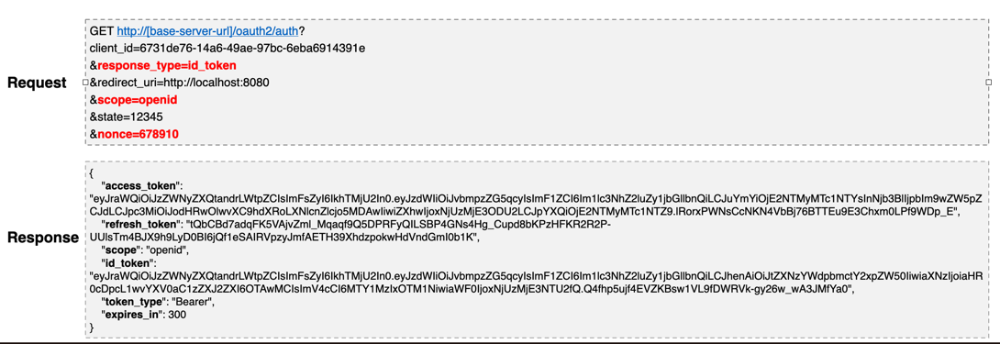

## Open ID Connect(OIDC)


- OAuth 2.0 프로토콜 위에 구축된 ID 계층, OAuth 2.0 기반의 인증 프로토콜
- scope 지정 시 ```openid``` 를 포함하면 Open ID Connect 사용이 가능함
- 인증에 대한 정보는 ```ID 토큰``` 이라고 하는 JSON 웹 토큰(JWT)으로 반환된다.
- 클라이언트가 사용자 ID를 확인할 수 있게 하는 보안 토큰인 ID Token 을 제공한다.

```
OAuth 2.0은 인가 프레임워크
OpenID Connect는 OAuth 2.0 의 최상위 레이어에 위치한 인증 전용 프로토콜
```

### ID Token
- 사용자가 인증 되었음을 증명하는 결과물.
- JWT로 표현되며 헤더, 페이로드 및 서명으로 구성.
- 어플리케이션은 공개 키로 ID 토큰을 검증 및 유효성을 검사하고 만료여부 등 토큰의 클레임을 확인.
- 클레임 정보(페이로드에 위치)에 포함되어 있는 사용자 정보를 활용해 인증 관리를 할 수 있음.

### 목적
```
ID Token은 API 요청에 사용해서는 안되며 사용자의 신원확인용으로 사용된다.
Access Token은 인증을 위해 사용해서는 안되며 리소스에 접근하기 위해 사용된다.
```


### OIDC 로그인 요청
- OIDC 상호 작용 행위자
  - **OpenID Provider**
    - 줄여서 `OP`라고 하며 `OpenID` 제공자로서 최종 사용자를 인증하고 인증 결과와 사용자에 대한 정보를 신뢰 담당자에게 제공할 수 있는 `OAuth 2.0 서버`를 의미.
  - **Relying Party**
    - 줄여서 `RP`라고 하며 신뢰 당사자로서 인증 요청을 처리하기 위해 OP에 "의존" 하는 `OAuth 2.0 애플리케이션`을 의미.

### 흐름
1. `RP` -> 권한 부여 요청 -> `OP`
2. OP는 최종 사용자를 인증하고 권한을 획득
3. `RP` <- ID 토큰, 액세스 토큰 <- `OP`
4. `RP`는 응답받은 액세스 토큰을 사용하여 `UserInfo` 엔드포인트(API)에 요청을 보낼수 있음.
5. `UserInfo` 엔드포인트는 최종 사용자에 대한 클레임을 반환.

### OIDC 로그인 요청
- **매개변수 요청 및 응답**
  - 요청 시 `openid` 범위를 `scope` 매개 변수에 포함해야 한다.
  - `response_type` 매개 변수는 `id_token`을 포함 한다.

