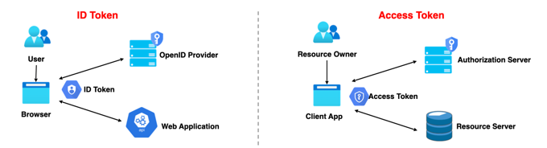

## Open ID Connect(OIDC)

-----

- OAuth 2.0 프로토콜 위에 구축된 ID 계층, OAuth 2.0 기반의 인증 프로토콜
- scope 지정 시 ```openid``` 를 포함하면 Open ID Connect 사용이 가능함
- 인증에 대한 정보는 ```ID 토큰``` 이라고 하는 JSON 웹 토큰(JWT)으로 반환된다.
- 클라이언트가 사용자 ID를 확인할 수 있게 하는 보안 토큰인 ID Token 을 제공한다.

```
OAuth 2.0은 인가 프레임워크
OpenID Connect는 OAuth 2.0 의 최상위 레이어에 위치한 인증 전용 프로토콜
```

### ID Token
- 사용자가 인증 되었음을 증명하는 결과물.
- JWT로 표현되며 헤더, 페이로드 및 서명으로 구성.
- 어플리케이션은 공개 키로 ID 토큰을 검증 및 유효성을 검사하고 만료여부 등 토큰의 클레임을 확인.
- 클레임 정보(페이로드에 위치)에 포함되어 있는 사용자 정보를 활용해 인증 관리를 할 수 있음.

### 목적
```
ID Token은 API 요청에 사용해서는 안되며 사용자의 신원확인용으로 사용된다.
Access Token은 인증을 위해 사용해서는 안되며 리소스에 접근하기 위해 사용된다.
```


