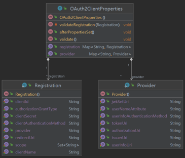

# Oauth 2.0 Client Fundamentals

## OAuth2ClientProperties

### 클라이언트 권한 부여 요청 시작
1. 클라이언트가 인가서버로 권한 부여 요청을 하거나 토큰 요청을 할 경우 클라이언트 정보 및 엔드포인트 정보를 참조하여 전달.
2. `application.yml` 환경설정 파일에 클라이언트 설정과 인가서버 엔트포인트 설정을 한다.
3. `application.yml` 파일에 있는 정보들이 `OAuth2ClientProperties` 클래스에 바인딩된다.
4. 바인딩된 정보를 통해 `ClientRegistration` 클래스 필드에 저장된다.
5. `ClientRegistration`를 참조하여 권한부여 요청을 위한 매개변수를 구성하고 인가서버와 통신한다.


### application.yml
```yaml
server:
  port: 8081

spring:
  security:
    oauth2:
      client:
        registration: # 클라이언트 설정
          keycloak:
            clientId: oauth2-client-app
            clientSecret: dXf021lMWuZ9kZafqxZn230MvVEdROIo
            clientName: oauth2-client-app
            authorizationGrantType: authorization_code
            scope: openid,profile
            clientAuthenticationMethod: client_secret_basic
            redirectUri: http://localhost:8081/client # keycloak에 등록해줘야함
            provider: keycloak

        provider: # 공급자 설정
          keycloak:
            issuerUri: http://localhost:8080/realms/oauth2
            authorizationUri: http://localhost:8080/realms/oauth2/protocol/openid-connect/auth
            jwkSetUri: http://localhost:8080/realms/oauth2/protocol/openid-connect/certs
            tokenUri: http://localhost:8080/realms/oauth2/protocol/openid-connect/token
            userInfoUri: http://localhost:8080/realms/oauth2/protocol/openid-connect/userinfo
            userNameAttribute: preferred_username
```

### OAuth2ClientProperties


- `Registration`은 인가 서버에 등록된 클라이언트 및 요청 파라미터 정보를 나타낸다.
- `Provider`는 공급자에게 제공하는 엔드포인트 등의 정보를 나타낸다.